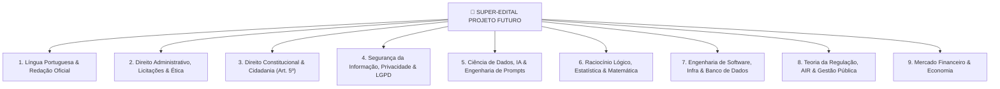

# 🚀 EDITAL UNIFICADO MESTRE — PROJETO FUTURO
> **Visão Estratégica Pré-Edital:** Unificação dos 3 Certames da Elite de TI e Regulação (**BACEN • ANPD • Banco do Brasil**).  
> **Filosofia:** "Você não estuda para um edital específico na fase pré-edital; você domina disciplinas de alta tecnologia, regulação e direito. Quando o primeiro edital for publicado, ativamos o modo pós-edital com 80%+ do conteúdo já dominado!"

---

## 🎯 As 9 Super-Disciplinas do Projeto Futuro

---

## 📊 Matriz de Cobertura Unificada (Sinergia Total)

| Super-Disciplina | BACEN | ANPD | BB TI | Sinergia | Onde Acessar no Vault |
| :--- | :---: | :---: | :---: | :---: | :--- |
| **1. Língua Portuguesa & Redação** | ✅ | ✅ | ✅ | ⭐⭐⭐ **Tríplice Coroa** | [[Concurso - BACEN/01 Lingua Portuguesa]] |
| **2. Direito Administrativo & Licitações** | ✅ | ✅ | 🟡 | ⭐⭐ **Federal** | [[Concurso - BACEN/03 Direito Administrativo]] |
| **3. Direito Constitucional & Cidadania** | ✅ | ✅ | 🟡 | ⭐⭐ **Federal** | [[Concurso - BACEN/03 Direito Administrativo]] |
| **4. Segurança da Info, LGPD & Privacidade** | ✅ | ✅ | ✅ | ⭐⭐⭐ **Tríplice Coroa** | [[Concurso - BACEN/06 Seguranca da Informacao]] |
| **5. Ciência de Dados, IA & Big Data** | ✅ | ✅ | ✅ | ⭐⭐⭐ **Tríplice Coroa** | [[Concurso - BACEN/05 Ciencia de Dados]] |
| **6. Estatística, Lógica & Matemática** | ✅ | 🟡 | ✅ | ⭐⭐ **Exatas** | [[Concurso - BACEN/02 Nocoes de Logica Estatistica]] |
| **7. Eng. de Software, Infra & Banco de Dados**| ✅ | 🟡 | ✅ | ⭐⭐ **TI Pesada** | [[Concurso - BACEN/07 Engenharia de Software]] |
| **8. Teoria da Regulação, AIR & Políticas** | 🟡 | ✅ | ❌ | 🛡️ **Específico ANPD/BACEN** | [[Concurso - ANPD]] |
| **9. Mercado Financeiro & Economia** | ✅ | ❌ | ✅ | 🏦 **Específico Financeiro** | [[Concurso - BACEN/04 Fundamentos de Macroeconomia Microeconomia]] |

---

## 📋 Trilha de Conteúdo Unificado

### 📖 MÓDULO 1: Língua Portuguesa & Redação Oficial
- [ ] Compreensão e Interpretação de Textos.
- [ ] Tipologia e Gêneros Textuais.
- [ ] Ortografia Oficial e Acentuação Gráfica.
- [ ] Coesão e Coerência (Mecanismos de Referenciação e Conectores).
- [ ] Sintaxe do Período Simples e Composto (Coordenação e Subordinação).
- [ ] Pontuação, Concordância e Regência (Nominal e Verbal + Crase).
- [ ] Colocação Pronominal e Reescrita de Frases.
- [ ] Redação Oficial (Manual da Presidência da República).

### ⚖️ MÓDULO 2: Direito Administrativo, Licitações & Ética
- [ ] Princípios da Administração Pública (LIMPE - Art. 37 da CF/88).
- [ ] Organização Administrativa (Administração Direta e Indireta, Autarquias Reguladoras).
- [ ] Atos Administrativos e Poderes Administrativos (Poder de Polícia, Normativo e Sancionatório).
- [ ] Servidores Públicos Civis Federais (Lei nº 8.112/1990).
- [ ] Improbidade Administrativa (Lei nº 8.429/1992 e Lei nº 14.230/2021).
- [ ] Processo Administrativo Federal (Lei nº 9.784/1999).
- [ ] Nova Lei de Licitações e Contratos (Lei nº 14.133/2021).
- [ ] Transparência e Acesso à Informação (LAI - Lei nº 12.527/2011).
- [ ] Ética no Serviço Público Federal (Decreto nº 1.171/1994) e Conflito de Interesses (Lei nº 12.813/2013).

### 📜 MÓDULO 3: Direito Constitucional & Cidadania
- [ ] Princípios Fundamentais (Arts. 1º a 4º da CF/88).
- [ ] Direitos e Garantias Fundamentais (Art. 5º da CF/88).
- [ ] Direito Fundamental à Proteção de Dados Pessoais (Art. 5º, LXXIX - EC 115/2022).
- [ ] Remédios Constitucionais (Habeas Data, Mandado de Segurança, Ação Popular).
- [ ] Competência Privativa da União para Legislar sobre Proteção de Dados (Art. 22, XXX).
- [ ] Organização do Estado e Organização dos Poderes.

### 🛡️ MÓDULO 4: Segurança da Informação, LGPD & Privacidade
- [ ] LGPD (Lei nº 13.709/2018): Princípios, Bases Legais, Direitos dos Titulares, DPO e Sanções.
- [ ] Estrutura, Competências e Resoluções da ANPD (Resoluções nº 1/2021, 2/2022, 4/2023, 15/2024).
- [ ] ECA Digital (Lei nº 15.211/2026 - Proteção de Crianças e Adolescentes no Ambiente Digital).
- [ ] Marco Civil da Internet (Lei nº 12.965/2014) e Crimes Cibernéticos.
- [ ] Privacy by Design, Privacy by Default e Técnicas de Anonimização/Pseudonimização.
- [ ] Criptografia (Simétrica, Assimétrica, Hash, TLS/VPN, ICP-Brasil).
- [ ] Gestão de Incidentes de Segurança e Forense Computacional.
- [ ] Normas ABNT NBR ISO/IEC 27001, 27002, 27701 (PIMS) e ISO 29151.
- [ ] NIST Cybersecurity Framework e Controles de Acesso (RBAC, ABAC, MFA, OAuth 2.0).

### 🤖 MÓDULO 5: Ciência de Dados, IA & Tecnologias Emergentes
- [ ] Conceitos de Inteligência Artificial, Machine Learning (Supervisionado, Não Supervisionado, Reforço) e Deep Learning.
- [ ] Grandes Modelos de Linguagem (LLMs) e IA Generativa.
- [ ] Governança e Ética em IA: Viés Algorítmico, Transparência, Explicabilidade (SHAP/LIME) e Auditoria de Modelos.
- [ ] Big Data, Mineração de Dados, Data Scraping e Rastreamento Online (Cookies/Fingerprinting).

### 📊 MÓDULO 6: Raciocínio Lógico, Estatística & Matemática
- [ ] Lógica Proposicional: Tabela Verdade, Operadores Lógicos e Negações.
- [ ] Lógica de Argumentação e Diagramas Lógicos.
- [ ] Estatística Descritiva: Variáveis, Média, Mediana, Moda, Variância e Desvio Padrão.
- [ ] Probabilidade: Conceitos Básicos, Distribuição Binomial e Distribuição Normal.

### 💻 MÓDULO 7: Engenharia de Software, Infraestrutura & Banco de Dados
- [ ] Arquitetura de Software: Microsserviços, REST, APIs e Padrões de Projeto.
- [ ] DevOps & DevSecOps: Containers (Docker), Orquestração (Kubernetes), CI/CD.
- [ ] Nuvem e Serviços Microsoft: Azure, Active Directory, Windows Server.
- [ ] Banco de Dados: Modelo Relacional, SQL, NoSQL e Data Warehouse/BI.

### 🏛️ MÓDULO 8: Teoria da Regulação, AIR & Políticas Públicas
- [ ] Teoria da Regulação: Regulação Econômica/Social, Assimetria de Informação e Falhas de Mercado.
- [ ] Lei Geral das Agências Reguladoras (Lei nº 13.848/2019).
- [ ] Análise de Impacto Regulatório (AIR) e Avaliação de Resultado Regulatório (ARR) (Decreto nº 10.411/2020).
- [ ] Ciclo de Políticas Públicas, PPA, LDO, LOA e Gestão por Resultados.

### 🏦 MÓDULO 9: Mercado Financeiro & Economia
- [ ] Sistema Financeiro Nacional (SFN) e Órgãos Reguladores (CMN, BACEN, CVM).
- [ ] Fundamentos de Microeconomia (Estrutura de Mercado) e Macroeconomia (Contas Nacionais, Agregados Monetários).
