# 🏛️ PROJETO FUTURO | Hub Central de Estudos
> **Meta:** Aprovação de Alto Nível em Tecnologia da Informação & Regulação  
> **Foco Principal:** [[Edital_Verticalizado_BACEN_2024|Auditor do Banco Central (BACEN)]]  
> **Foco Regulatório & Privacidade:** [[Edital_Verticalizado_ANPD_2025|Especialista da ANPD (Proteção de Dados)]]  
> **Foco Bancário de TI:** [[Edital_Verticalizado_BB_TI|Agente de Tecnologia (Banco do Brasil)]]

---

## 📂 Estrutura do Ecossistema de Pastas

- 📁 **Concurso - BACEN**: Materiais brutos, PDFs de aulas (ex: `LinguaPortuguesa/`) e editais do Banco Central.
- 📁 **Concurso - ANPD**: Edital oficial do Processo Seletivo/Concurso e matérias específicas de proteção de dados.
- 📁 **Concurso - Banco do Brasil**: Materiais, apostilas e provas anteriores do BB TI.
- 📁 **[[02 - Resumos/Direito Constitucional - Art 5 e Proteção de Dados|02 - Resumos]]**: Nosso Segundo Cérebro no Obsidian — onde conectamos o conteúdo dos PDFs em notas atômicas, esquemas e jurisprudência.
- 📁 **app**: Aplicativo Web de Produtividade, Pomodoro, Simulador Cebraspe e Discursivas (`Abrir_App_BACEN.bat`).

---

## ⚡ Acesso Rápido às Ferramentas

* 🚀 **Aplicativo Web Interativo:** Execute o arquivo `Abrir_App_BACEN.bat` ou abra `app/index.html` no seu navegador.
* 📊 **Planilha Oficial de Acompanhamento:** [[Planilha Acompanhamento BACEN 2024.xlsx]]
* 📝 **Caderno de Exercícios & Baterias:** [[Cadernos BACEN 2024.xlsx]]
* 🔗 **Repositório GitHub:** [github.com/Ashiuchi/projeto_futuro](https://github.com/Ashiuchi/projeto_futuro)

---

## 🧭 Editais Mestres & Matrizes de Sinergia (Obsidian)

* 🏛️ [[Concurso - BACEN/Edital_Mestre_Verticalizado_BACEN|Edital Mestre Verticalizado BACEN]] — Fusão histórica e probabilística (2002 a 2024), análise de ROI e 100% dos tópicos Cebraspe.
* 🛡️ [[Concurso - ANPD/Edital_Verticalizado_ANPD_2025|Edital Mestre Verticalizado ANPD]] — Matriz Oficial IADES/Agências Federais (75% da nota em TI e Regulação).
* 🏦 [[Preparação BB/Edital_Verticalizado_BB_TI|Edital Verticalizado BB TI]] — Base Cesgranrio (Reserva técnica estratégica).

---

### 2. Trilhas de Conhecimento por Disciplina

```mermaid
graph TD
    A["⭐ Tríplice Coroa (BACEN • ANPD • BB)"] --> B["Segurança da Informação & Gestão de Riscos"]
    A --> C["LGPD & Privacidade (ISO 27701)"]
    A --> D["Engenharia de Software & DevSecOps"]
    A --> E["Infraestrutura em TI & Nuvem (K8s/Azure)"]
    A --> F["Ciência de Dados & IA"]
    A --> G["Bancos de Dados & SQL"]
    A --> H["Língua Portuguesa"]

    I["Sinergia Federal (BACEN + ANPD)"] --> J["Direito Constitucional (Art. 5º / Art. 37)"]
    I --> K["Direito Administrativo (Lei 8.112 / Lei 9.784)"]
    I --> L["Licitações e Contratos (Lei 14.133/2021)"]

    M["Exclusivos"] --> N["Micro & Macroeconomia (BACEN)"]
    M --> O["Conhecimentos Bancários & Inglês (BB)"]
```

#### 🛡️ Núcleo Central de Segurança, Dados & Regulação:
* [[Segurança da Informação e ISO 29151]]
* [[LGPD e Resoluções da ANPD]]
* [[Inteligência Artificial e Proteção de Dados]]
* [[Gestão de Riscos e Cibersegurança]]

#### 💻 Núcleo de Engenharia e Infraestrutura:
* [[Arquitetura de Microsserviços e Padrão Saga]]
* [[DevOps, DevSecOps e CI-CD]]
* [[Containers, Docker e Kubernetes]]
* [[Serviços Microsoft Windows Server e Active Directory]]

#### ⚖️ Núcleo Jurídico e Administrativo (Para quem vem de TI):
* [[Direito Constitucional - Art 5 e Proteção de Dados]]
* [[Direito Administrativo - Princípios LIMPE e Atos]]
* [[Regime Jurídico dos Servidores - Lei 8112]]
* [[Nova Lei de Licitações - Lei 14133]]

---

## 🎯 Meta Semanal (25 Horas Líquidas)

| Bloco | Carga | Distribuição |
| :--- | :---: | :--- |
| **Segunda a Sexta** | 15h (3h/dia) | 2 blocos diários de 1h30 (Teoria Gran Cursos + Questões) |
| **Sábado** | 5h | 1h Revisão Flashcards + 2h Bateria Cebraspe/IADES + **2h Discursiva Técnica** |
| **Domingo** | 5h | 2h Simulado Básicos + 1h Dissertação Atualidades + 1h Banco de Dados + 1h Métricas |

---

## 📌 Dicas para o Obsidian
1. Pressione `Ctrl + O` para abrir rapidamente qualquer nota pelo nome.
2. Pressione `Ctrl + G` para ver o **Grafo Interativo**, mostrando como todos os seus resumos e editais se conectam visualmente!
3. Digite `[[` no meio de qualquer texto para criar um link automático para outro assunto.
