# 📅 PLANO DE ESTUDOS DIÁRIO & DIÁRIO DE MENTORIA
> **Objetivo:** O seu direcionamento diário de metas, tarefas de estudo, broncas construtivas da IA e acompanhamento de melhorias em tempo real.
> **Última Atualização:** 12/09/2026 — 21:42

---

## 🚀 AMANHÃ: 13/09/2026 (Domingo de Guerra — 5h Líquidas)

> [!IMPORTANT] 🎯 MARATONA DOS CAMPEÕES (5 HORAS COMPLETAS SEM DESCULPAS)
> Depois de um sábado atípico cumprindo o dever de pai e parceiro, **o domingo é o dia da virada de chave!** Vamos focar 100% no cumprimento das 5 horas líquidas distribuídas em 4 blocos de teoria/questões + 1 bloco de laboratório discursivo.

```mermaid
gantt
    title Cronograma de Domingo (5h Líquidas + Laboratório Discursivo)
    dateFormat  HH:mm
    axisFormat %H:%M
    section Bloco 1 (1h30)
    Português (Sintaxe, Conectivos & Questões Cebraspe) : active, b1, 09:00, 10:30
    section Bloco 2 (1h30)
    ANPD & LGPD (Pasta Organizada + ECA Digital Lei 15211) : active, b2, 10:45, 12:15
    section Bloco 3 (1h00)
    Raciocínio Lógico & Estatística (Binomial/Normal) : active, b3, 14:30, 15:30
    section Bloco 4 (1h00)
    Direito Administrativo & Constitucional (LIMPE / Lei 8112) : active, b4, 15:45, 16:45
    section Prática Discursiva
    Laboratório App Web (2 Redações Técnicas BACEN/ANPD) : active, b5, 17:00, 18:00
```

---

### 📚 Detalhamento dos Blocos de Domingo (13/09/2026)

#### 🔹 Bloco 1: Língua Portuguesa (1h30) — *Sintaxe do Período Composto, Conectivos & Bateria*
- **Material de Apoio:** Nota [[02 - Resumos/Português/Língua Portuguesa - Sintaxe e Conectivos|Língua Portuguesa - Sintaxe e Conectivos]]
- **Metas do Bloco:**
  - [ ] Consolidar conjunções concessivas vs causais (*conquanto* x *porquanto*, *não obstante*, *malgrado*).
  - [ ] Fazer 25 questões Cebraspe / IADES / Cesgranrio no app ou site de questões.
  - [ ] Aplicar o filtro do BACEN: pular fonética/formação de palavras e focar em sintaxe e interpretação.

#### 🔹 Bloco 2: ANPD & Legislação Especial (1h30) — *Validação da Pasta ANPD + ECA Digital*
- **Material de Apoio:** [[02 - Resumos/ECA Digital - Lei 15211 e Atuação da ANPD]] e [[02 - Resumos/LGPD e Resoluções da ANPD]]
- **Metas do Bloco:**
  - [ ] Validar a reestruturação e indexação da pasta `Concurso - ANPD`.
  - [ ] Mapear as obrigações dos agentes de tratamento na proteção de crianças e adolescentes (Lei 15.211/2026).
  - [ ] Resolver 15 questões IADES sobre a LGPD e resoluções da ANPD.

#### 🔹 Bloco 3: Raciocínio Lógico & Estatística (1h00) — *Foco no Edital BACEN*
- **Material de Apoio:** Pasta `Concurso - BACEN/02 Nocoes de Logica Estatistica`
- **Metas do Bloco:**
  - [ ] Revisar Tabela Verdade e Operadores Condicionais (`1.1 1.3 10.3.1...`).
  - [ ] Focar em Distribuição Normal e Binomial (`2.6...`), descartando outras distribuições conforme o ROI definido.
  - [ ] Resolver 10 questões de fixação Cebraspe.

#### 🔹 Bloco 4: Direito Administrativo (1h00) — *Base dos Servidores Federais*
- **Material de Apoio:** Pasta `Concurso - BACEN/03 Direito Administrativo`
- **Metas do Bloco:**
  - [ ] Revisar Princípios LIMPE + Atos Administrativos + Lei 8.112/1990 (Deveres, Proibições e Penalidades).
  - [ ] Resolver 15 questões Cebraspe / IADES.

#### 🔹 Bloco 5: Laboratório Discursivo no App (1h00) — *Prática Intensiva*
- **Execução:** Executar `Abrir_App_BACEN.bat` ou abrir `app/index.html`.
- **Desafio de Hoje:** 
  - [ ] Redigir 1 Discursiva sobre **LGPD / ANPD** (20 a 30 linhas).
  - [ ] Redigir 1 Discursiva sobre **Segurança da Informação / ISO 27001** (20 a 30 linhas).
  - [ ] Obrigatoriedade: Usar conectivos formais (*"Conquanto..."*, *"Não obstante..."*, *"Cumpre salientar..."*).

---

## 🤠 BRONCAS DO MENTOR & REGRAS DE OURO

> [!WARNING] 🚨 BRONCA #1: O DOMINGO É O DIA DA RECOMPOSIÇÃO!
> Não caia na armadilha de achar que o fim de semana acabou. Quem passa nos primeiros lugares do BACEN e da ANPD estuda no domingo com a mesma garra de quem está no campo de batalha. Cumpra as 5h líquidas sem barganha!

> [!IMPORTANT] 💡 BRONCA #2: O PODER DAS QUESTÕES APÓS O BLOCAGEM
> A cada bloco teórico finalizado, **faça imediatamente a bateria de 10 a 20 questões**. Não deixe para acumular questões no fim do dia!

> [!TIP] ✅ MELHORIA APLICADA
> Com as pastas do BACEN (e a da ANPD que você está organizando agora) 100% mapeadas com os numerais do edital, o seu ritmo de consulta ficou 3x mais rápido.

---

## 🗓️ HISTÓRICO & CRONOGRAMA DA SEMANA

| Data | Dia | Foco Principal | Carga | Status |
| :--- | :--- | :--- | :---: | :---: |
| 10/09 | Qui | Conclusão PDFs BACEN + Configuração Obsidian/App | 3h | ✅ Concluído |
| 11/09 | Sex | Sintaxe Português + ECA Digital (ANPD) | 2h45 | ✅ Concluído |
| 12/09 | Sáb | Emergência Familiar + Organização Mapeada da Pasta BACEN | 2h Ops | ✅ Concluído |
| **13/09** | **Dom** | **DOMINGO DE GUERRA: 5h Líquidas (Português + ANPD + Estatística + Direito Adm + 2 Discursivas)** | **5h** | **🎯 AGENDADO / EM EXECUÇÃO** |

---
*Mantenha este arquivo aberto no painel lateral do Obsidian para ir marcando as caixas de seleção `[x]` conforme avança!*
