# 📅 PLANO DE ESTUDOS DIÁRIO & DIÁRIO DE MENTORIA
> **Objetivo:** O seu direcionamento diário de metas, tarefas de estudo, broncas construtivas da IA e acompanhamento de melhorias em tempo real.
> **Última Atualização:** 11/09/2026 — 19:15

---

## 🚀 HOJE: 11/09/2026 (Sexta-Feira)

### 🎯 Meta do Dia: 3 Horas Líquidas

```mermaid
gantt
    title Planejamento de Hoje (3h Líquidas + Discursiva)
    dateFormat  HH:mm
    axisFormat %H:%M
    section Bloco 1 (1h30)
    Língua Portuguesa (Sintaxe & Conectivos) : active, b1, 19:30, 21:00
    section Bloco 2 (1h30)
    ANPD & Legislação (ECA Digital Lei 15211 + Upload PDFs) : active, b2, 21:15, 22:45
    section Prática (30m)
    App Web (Bateria Cebraspe + Treino Discursiva) : active, b3, 22:45, 23:15
```

---

### 📚 Tarefas Detalhadas por Bloco

#### 🔹 Bloco 1: Língua Portuguesa (1h30) — *Sintaxe do Período Composto & Conectivos*
- **Material de Apoio:** Nota [[02 - Resumos/Português/Língua Portuguesa - Sintaxe e Conectivos|Língua Portuguesa - Sintaxe e Conectivos]]
- **Metas do Bloco:**
  - [ ] Revisar valor semântico das conjunções concessivas (*embora, conquanto, malgrado, a despeito de, não obstante*).
  - [ ] Fazer 15 a 20 questões de fixação comparando Cebraspe (Certo/Errado) vs IADES vs Cesgranrio.
- **Pegadinha da Banca:**
  - 🚨 *Cebraspe:* Troca de *"conquanto"* (concessiva) por *"porquanto"* (causal/explicativa).
  - 🚨 *IADES:* Cobra exigência do modo subjuntivo nas orações concessivas.

#### 🔹 Bloco 2: Proteção de Dados & ANPD (1h30) — *Lei 15.211/2026 (ECA Digital) & Organização ANPD*
- **Material de Apoio:** Nota [[02 - Resumos/ECA Digital - Lei 15211 e Atuação da ANPD|ECA Digital - Lei 15211 e Atuação da ANPD]]
- **Metas do Bloco:**
  - [ ] Concluir o upload dos materiais em PDF referentes ao edital da **ANPD**.
  - [ ] Mapear as novas atribuições da ANPD no ECA Digital (Lei 15.211/2026) sobre verificação de idade e proteção infantil online.
  - [ ] Conectar os conceitos com a [[02 - Resumos/LGPD e Resoluções da ANPD|LGPD e Resoluções da ANPD]].

#### 🔹 Bloco 3: Prática e Laboratório (30 min)
- **Execução:** Abrir o aplicativo web (`Abrir_App_BACEN.bat` ou `app/index.html`).
- **Desafio:** Escrever 1 parágrafo discursivo de 10 a 15 linhas usando pelo menos 2 conectivos de alto nível (*"Não obstante"*, *"Conquanto"*).

---

## 🤠 BRONCAS DO MENTOR & ANOTAÇÕES DE MELHORIA

> [!WARNING] 🚨 BRONCA #1: CUIDADO COM A ILUSÃO DO ESTUDO PASSIVO!
> Ler PDF ou ver videoaula dá sensação de dever cumprido, mas **sem fazer bateria de questões no mesmo dia**, a retenção cai mais de 60% em 48 horas. Não feche o dia sem fazer pelo menos 15 questões no site de questões ou no app!

> [!IMPORTANT] 💡 BRONCA #2: DISCURSIVA NÃO É PARA O FIM DE SEMANA APENAS!
> No concurso do BACEN e da ANPD, a discursiva elimina quem sabe a teoria mas não sabe estruturar a resposta técnica sob pressão. Você precisa acostumar seus dedos a redigirem com clareza e termos formais diariamente.

> [!TIP] ✅ MELHORIA APLICADA HOJE
> Unificamos este arquivo `PLANO_DE_ESTUDOS_DIARIO.md` e sincronizamos com o GitHub. Agora, de qualquer computador (trabalho, casa ou notebook), ao abrir o Obsidian, este plano e o seu progresso estarão gravados exatamente no mesmo ponto!

---

## 🗓️ HISTÓRICO & CRONOGRAMA DA SEMANA

| Data | Dia | Foco Principal | Carga | Status |
| :--- | :--- | :--- | :---: | :---: |
| 10/09 | Qui | Conclusão PDFs BACEN + Configuração Obsidian/App | 3h | ✅ Concluído |
| **11/09** | **Sex** | **Sintaxe Português + ECA Digital (ANPD) + Upload PDFs** | **3h** | **🟡 EM ANDAMENTO** |
| 12/09 | Sáb | Revisão Geral + Bateria Cebraspe/IADES + **2h Discursiva** | 5h | ⏳ Agendado |
| 13/09 | Dom | Simulado Conhecimentos Básicos + Redação + Métricas | 5h | ⏳ Agendado |

---
*Mantenha este arquivo aberto no painel lateral do Obsidian para ir marcando as caixas de seleção `[x]` conforme avança!*
